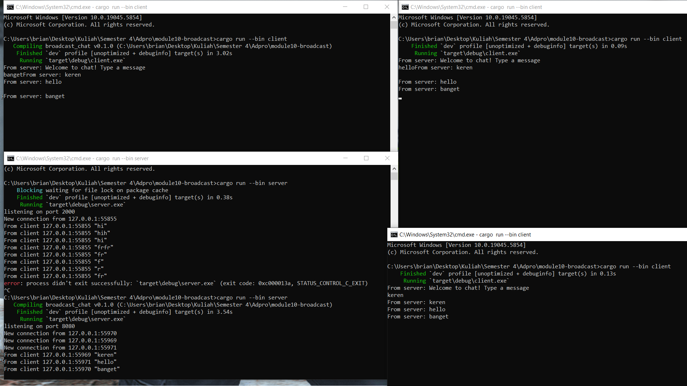

# Module 10

Muhammad Brian Subekti 2306256444


## 2.1 Original code of broadcast chat.

##  How to run

1. **Build the project**

   ```sh
   cargo build 
   ```

2. **Start the server**

   ```sh
   cargo run --bin server
   ```

   This will bind to `127.0.0.1:2000` and wait for incoming client connections.

3. **Start three clients**
   In *three* separate terminals, run:

   ```sh
   cargo run --bin client
   ```

   Each client will connect to the server on port 2000.

4. **Chat!**

    * Type a message in *any* client and press Enter.
    * The server logs the raw message it received and then broadcasts it back to *all* connected clients.
    * Each client prints incoming messages prefixed with `From server:`.

---

##  Demo


In the screenshot above:

1. **Top-left** window is the **server**, showing:

   ```
   listening on port 2000
   New connection from 127.0.0.1:55312
   New connection from 127.0.0.1:55313
   New connection from 127.0.0.1:55314
   From client 127.0.0.1:55312: "halo"
   From client 127.0.0.1:55313: "keren banget"
   From client 127.0.0.1:55314: "cool"
   ```
2. **Other three** windows are **clients**. When you type:

   ```
   halo
   ```

   in client 1, *all* clients display:

   ```
   From server: halo
   ```

   and similarly for the other messages.

---

##  What happens under the hood

* **Server**

    * Listens on TCP port 2000.
    * Accepts each connection and spawns a lightweight task to read lines.
    * Whenever a line arrives, it pushes it onto a broadcast channel.

* **Clients**

    * Connect to the server’s socket.
    * Spawn two asynchronous tasks:

        1. **Reader**: listens for incoming broadcasts and prints them.
        2. **Writer**: reads your keyboard input and sends it to the server.


## 2.2 Modifiying the web socket port


### 1. Where to modify

* **Server** (`server/src/main.rs`):

  ```diff
  - let listener = TcpListener::bind("127.0.0.1:2000").await?;
  + let listener = TcpListener::bind("127.0.0.1:8080").await?;
  ```

* **Client** (`client/src/main.rs`):

  ```diff
  - let socket = TcpStream::connect("127.0.0.1:2000").await?;
  + let socket = TcpStream::connect("127.0.0.1:8080").await?;
  ```

There are no other port references—this is raw TCP with newline-delimited UTF-8, not HTTP or WebSocket.

### 2. Expected behavior when mismatched

If one side still uses port 2000 and the other port 8080, clients will immediately see:

```
Connection refused (os error 10061)
```

because nothing is listening on the target port.

### 3. Testing on port 8080

1. Rebuild and start the server:

   ```sh
   cargo run --bin server
   ```

   You should see:

   ```
   listening on port 8080
   New connection from 127.0.0.1:xxxxx
   From client 127.0.0.1:xxxxx: "hello"
   ```
2. In separate terminals, run each client:

   ```sh
   cargo run --bin client
   ```
3. Type messages—each client should receive:

   ```
   From server: <your message>
   ```

### 4. Demo (Port 8080)



Here you can see:

* **Server** (bottom-left) now listening on port 8080 and logging connections from three clients.
* **Clients** (other windows) each show the broadcasted messages: “keren”, “hello”, and “banget”.

## Small changes. Add some information to client


We try to add information about the sender to each client. Since we don’t have a name yet, we simply include the sender’s IP:Port in every broadcasted message. This lets you see exactly which client sent each message, without implementing a full username system yet.

### 1. What and where to modify

- **Server** (`server/src/main.rs`):  
  Change the broadcast line to include `addr` (the client’s `SocketAddr`):
  ```diff
  - bcast_tx.send(text.clone())?;
  + bcast_tx.send(format!("{addr} : {text}"))?;


* **Client** (`client/src/main.rs`):
  In the receive loop, prepend a local identifier (e.g. your machine’s name) so you know which output belongs to you:

  ```diff
  - println!("From server: {}", text);
  + println!("Brian's Computer - From server: {}", text);
  ```

No other files need editing—communication still runs over raw TCP wrapped in WebSocket frames, carrying newline-delimited UTF-8.

### 2. Why these changes?

* **IP\:Port tag**
  Without user accounts, seeing the sender’s `SocketAddr` (IP and port) clearly distinguishes messages coming from different clients.
* **Local prefix**
  Adding `"Brian's Computer"` simulates a hostname or username, making it easier to tell which client window printed which line when you have multiple terminals open.

### 3. Demo (Small changes)


In this screenshot:

* Each **client** prints lines like:

  ```
  Brian's Computer - From server: 127.0.0.1:56075 : halo
  ```
* The **server** still logs the raw inbound address and message:

  ```
  From client 127.0.0.1:56075 "halo"
  ```

